# Création d'un projet de réalité augmentée (AR) avec URP

## Créer un projet 3D standard:
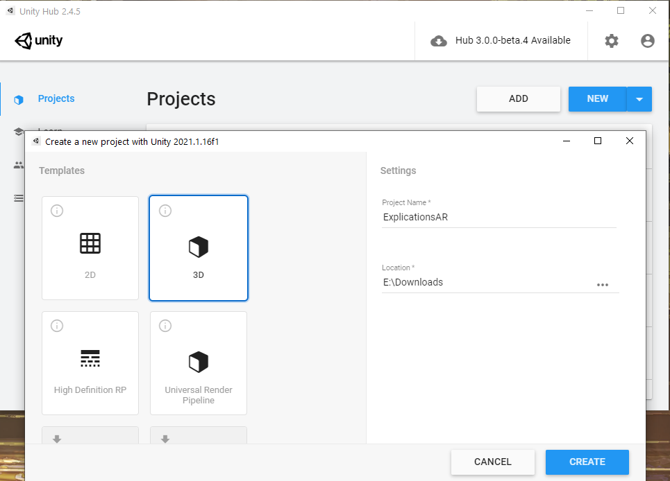

## Changer la plateforme de publication
1. Ouvrir le panneau de `Build Settings` (`Ctrl+Shift+B`)
2. Cliquer sur la plateforme Android
3. Appuyer sur le bouton `Switch Plateform`
4. Attendre la fin du chargement

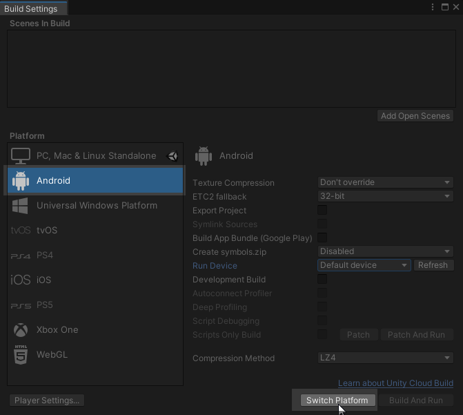

## Configurer l'application
1. Toujours dans la fenêtre `Build Settings`, appuyer sur le bouton `Player Settings` en bas à gauche
2. Changer les informations comme le `Company Name` et le `Product Name` qui seront utilisées comme nom d'application sur l'appareil.
3. Changer le `Minimum API Level` pour 24 

    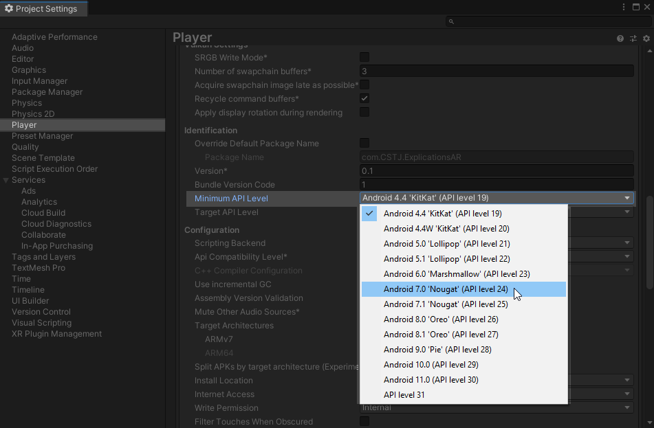

4. Cocher le checkbox `Auto Graphics API`
5. S'assurer que `Color Space` est à `Gamma` 

    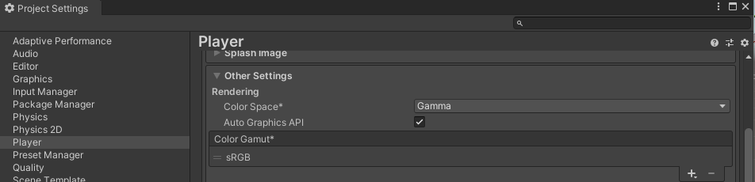

## Publier l'application 
De retour dans la fenêtre `Build Settings`, il faut maintenant choisir l'appareil sur lequel publier.
1. Connecter l'appareil à l'ordinateur avec un fil USB
3. Autoriser l'accès de l'ordinateur sur l'appareil
4. Appuyer sur `Refresh` à coté de l'option `Run Device`
5. Sélectionner l'appareil. Si l'appareil n'apparaît pas dans la liste, voir plus bas
6. Appuyer sur `Build and Run` en bas à droite
7. Sélectionner un dossier dans lequel mettre le fichier .apk (idéalement un nouveau dossier `Builds`)

    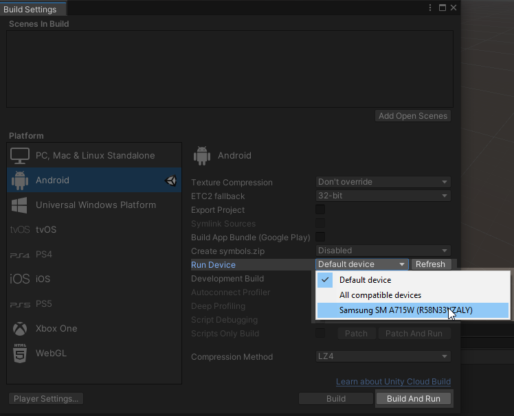
    

### Si l'appareil **android n'est pas listé**
1. S'assurer que l'appareil est bien déverouillé
2. [Activer le mode développeur](https://developer.android.com/studio/debug/dev-options)
3. [Activer le USB Debugging](https://developer.android.com/studio/debug/dev-options#enable)
4. Autoriser la communication avec l'ordinateur, sur l'appareil lorsqu'on le connecte et que la demande d'autorisation apparaît 
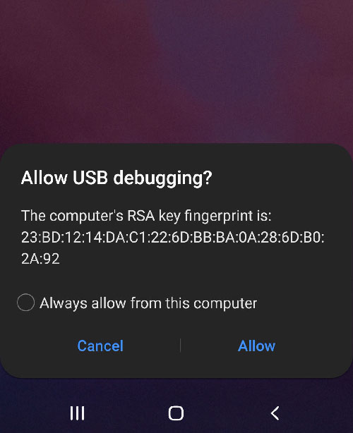

5. Au besoin, définir le type de connexion comme `File Transfert` ou `MTP` sur l'appareil

## Installer AR Foundation
Dans le Package Manager (menu `Window > Package Manager`), installer les packages suivants
1. AR Foundation
2. ARCore XR Plugin
4. Universal RP

    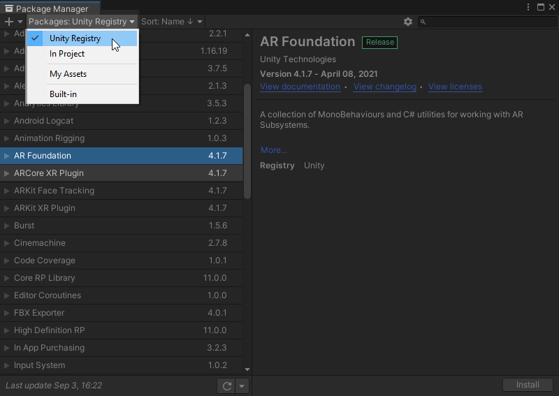

Note: Pour iOS, il faut installer `ARKit XR Plugin` plutôt que `ARCore XR Plugin`

## Activer ARCore
Dans les `Project Settings`, sous la catégorie `XR Plugin Management`, il faut activer `ARCore`

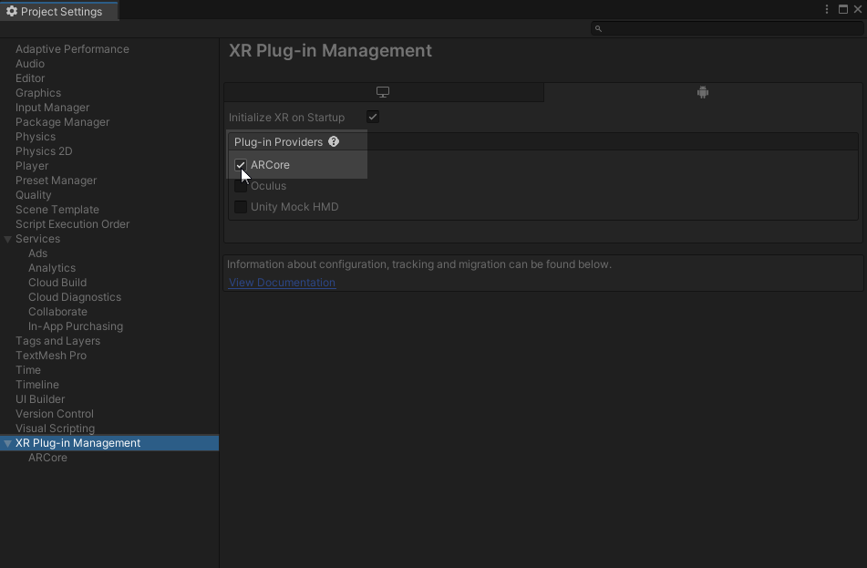

## Passer le projet au Universal Render Pipeline (URP)
1. Créer un dossier "URP" dans les assets.
2. Dans le dossier URP, créer un Forward Renderer (deux fichiers seront créés): 
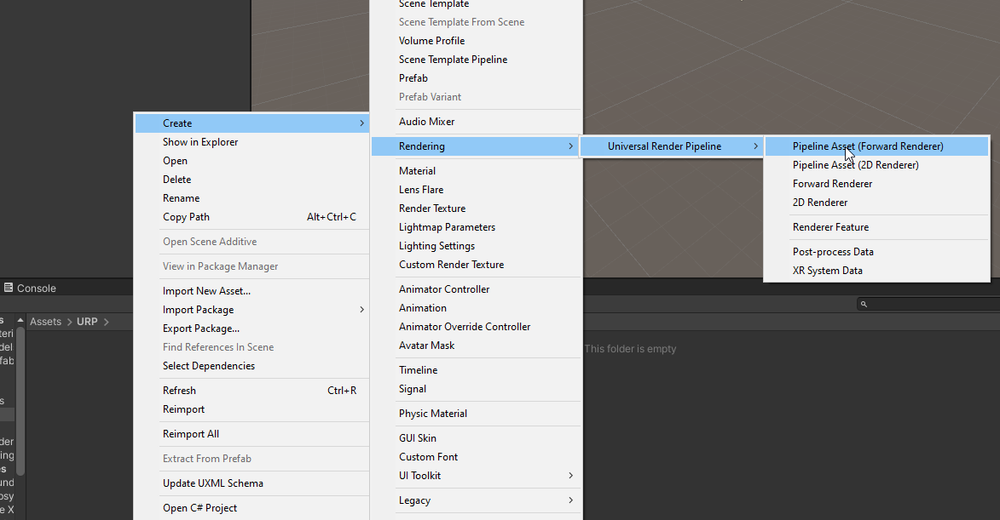

3. Sélectionner le Forward Renderer et, dans l'inspecteur, ajouter un `Renderer Feature` nommé `AR Background Renderer Feature` 
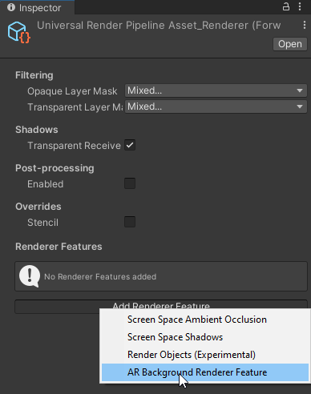

4. Dans `Project Settings > Graphics`, configurer le projet pour qu'il utilise le nouveau renderer. 
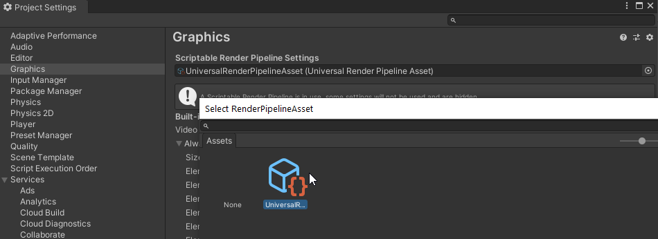

## Ajouter les essentiels de l'app AR à la hiérarchie du projet

1. Ajouter un `XR > AR Session Origin`
2. Ajouter un `XR > AR Session`
3. Supprimer la `Main Camera`
4. Ajouter le tag `MainCamera` à la caméra automatiquement créée sous le `AR Session Origin`

    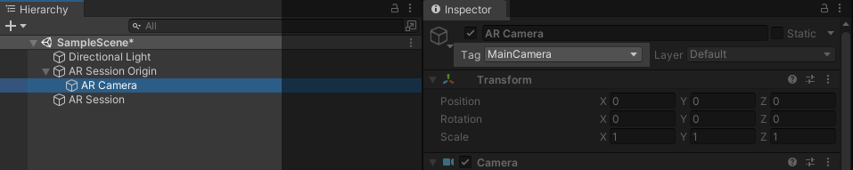

## Tester le projet

Si tout est bien configuré, le projet devrait pouvoir être build et exécuter sur l'appareil. La caméra devrait s'afficher et aucune erreur ne devraient être présentes dans la console de Unity.

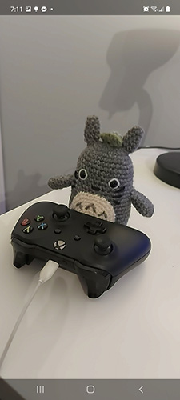