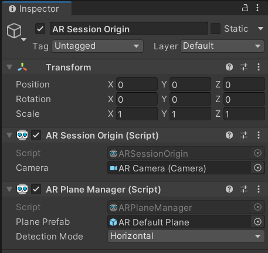
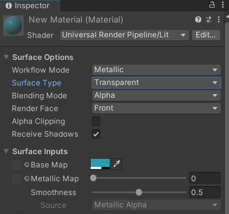
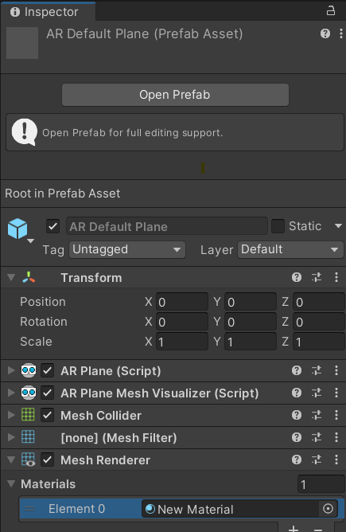
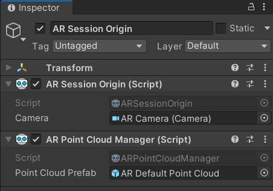

# Plane Tracking

Il est souvent utile de pouvoir visualiser l'environnement créé par AR Foundation pendant l'exécution de l'application. Le component `AR Plane Manager` nous permet de voir la bordure ainsi que la surface des zones détectées. Il est aussi nécessaire pour faire la détection par raycasting.

1. Sur le `AR Session Origin`, ajouter un `AR Plane Manager`.
    - Detection Mode : Horizontal ou vertical?
2. Ajouter un nouveau GameObject `AR > Default Plane`
3. Créer un prefab avec le `AR Default Plane` en le glissant dans les Assets
4. Supprimer le `AR Default Plane` de la hiérarchie
5. Glisser le prefab dans le component `AR Plane Manager` du `AR Session Origin` que nous avons ajouter au point #1

## Optionel : Définir un matériel URP pour les planes
1. Créer un nouveau `Material`
2. Changer le `Surface Type` du matériel pour `Transparent`
3. Baisser l'opacité de la couleur

4. Remplacer le matériel utilisé dans le prefab `AR Default Plane`

# Point Tracking
Même chose que Plane Tracking mais avec le `AR Point Manager`

