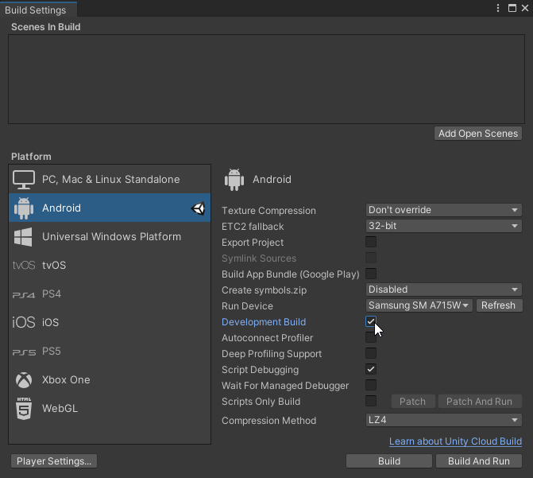
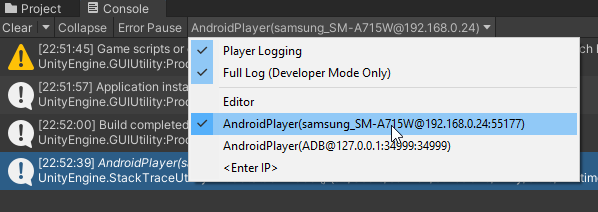

# Débugger notre projet sur Android

1. Ouvrir la fenêtre `Build Settings` avec `Ctrl+Shift+B`
2. Cocher `Development Build`  et `Script Debugging` 

3. Build l'application
4. Dans la console, choisir l'appareil dans le menu déroulant sous `Editor` 
