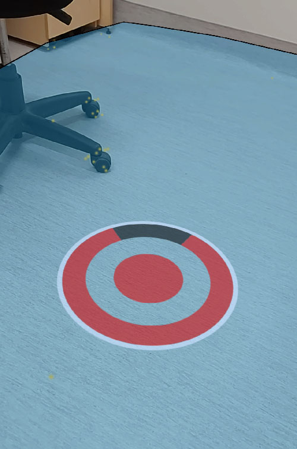

# Curseur

1. Ajouter un `AR Raycast Manager` sur le `AR Session Origin`
2. Ajouter un `AR Plane Manager` sur le `AR Session Origin`
3. Créer un GameObject qui servira de visuel pour le curseur (ex: Plane avec une image) avec le script [Cursor.cs](scripts/Cursor.cs).
4. Changer le scale du GameObject de visuel à environ 0.05 (1 unité = 1m, donc 0.05 = 5cm
)
5. Associer le `AR Raycast Manager` du `AR Session Origin` au script Cursor dans l'inspecteur.

    
