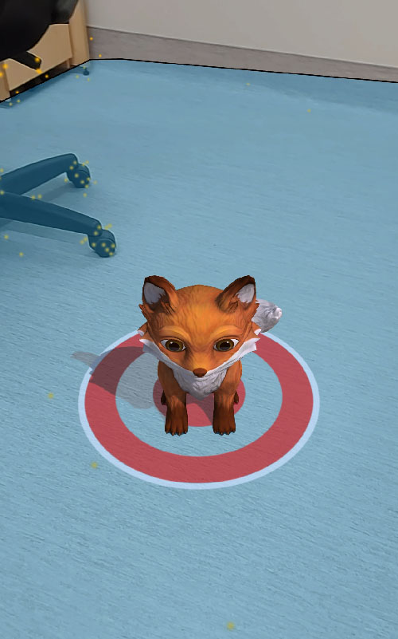
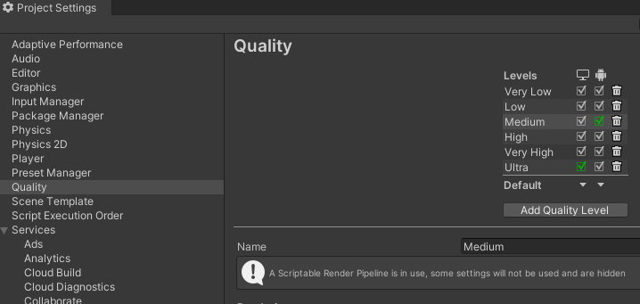
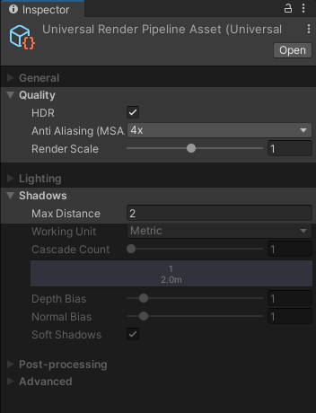

# Instantiation d'objets 3D

## Instantiation sur le curseur
1. Créer un empty avec le script [SpawnAtTarget.cs](scripts/SpawnAtTarget.cs)
2. Associer un prefab dans l'inspecteur (attention au scale qui devrait tourner autour de 0.05!)
3. Associer la cible (ex: curseur) dans l'inspecteur

    

## Instantiation lors d'un "touch"

1. Ajouter un `AR Raycast Manager` sur le `AR Session Origin`
2. Ajouter un `AR Plane Manager` sur le `AR Session Origin`
3. Créer un empty avec le script [SpawnOnTouch.cs](scripts/SpawnOnTouch.cs)
4. Associer un prefab dans l'inspecteur (attention au scale qui devrait tourner autour de 0.05!)
5. Associer le `AR Raycast Manager` du `AR Session Origin` au script SpawnOnTouch dans l'inspecteur

## Qualité du rendu, et particulièrement des ombres

Les projets Android utilisent la qualité "Medium" par défaut dans les réglages. Il est possible de changer quelques réglages à cet endroit, ou tout simplement augmenter la qualité cible du build Android.

Toutefois, la majorité des réglages de qualité avec URP se font dans dans l'asset de URP lui-même. L'option la plus importante dans notre cas est le `Max Distance` que l'ont doit réduire puisque nos modèles sont tout petits.

