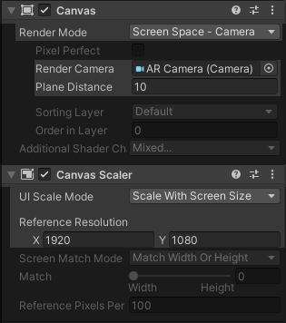
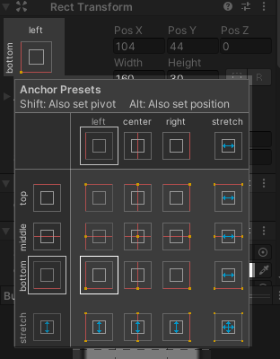

# Canvas et AR

L'utilisation du canvas en AR est la même que sur nos projets sur ordinateur, mais la configuration est un peu particulière puisque nous utilisons la caméra AR.

1. Changer le `Render Mode` en `Screen Space Camera`
2. Associer la `AR Camera` au `Render Camera`
3. Changer le `Plane Distance` pour un chiffre entre 0 et 20. Par exemple 10.
4. Changer le `UI Scale Mode` à `Scale With Screen Size`
5. Changer la résolution de référence pour des chiffres plus représentatif. (Réfléchir si l'app sera en portrait ou landscape)

    


## Le point d'ancrage

Il sera aussi particulièrement important de bien utiliser les points d'ancrages sur nos éléments de canvas puisque tous les téléphones ont des résolutions différentes.



## Relancer une scène

Rappel : Il est possible de relancer une scène avec un script comme celui-ci :
```c#
public void ResetScene()
{
    UnityEngine.SceneManagement.SceneManager.LoadScene(UnityEngine.SceneManagement.SceneManager.GetActiveScene().buildIndex);
}
```