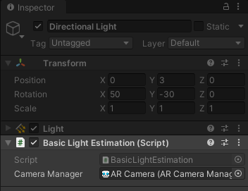
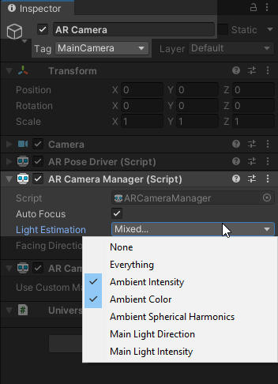

# Estimation de lumière environnente

Pour rendre nos modèles 3D plus réalistes avec l'environnement, il est souvent utile de faire varier l'intensité et la couleur de la lumière.

 

1. Appliquer le script [BasicLightEstimation.cs](scripts/BasicLightEstimation.cs) sur notre lumière directionnelle principale ce qui permet d'analyser l'image de la caméra et de changer les propriétés de la lumière automatiquement.
2. Associer l'`AR Camera` au script.

    

3. Dans l'`AR Camera`, changer le `Light Estimation` du component `AR Camera Manager` pour que **uniquement** `Ambient intensity` et `Ambient color` soient cochés

    