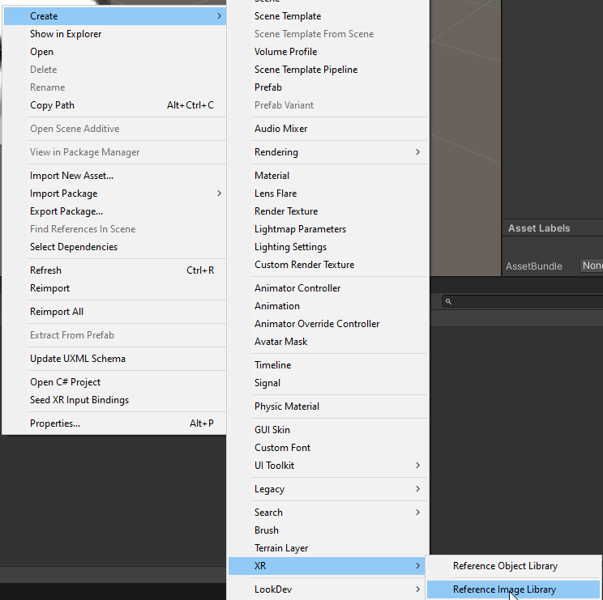
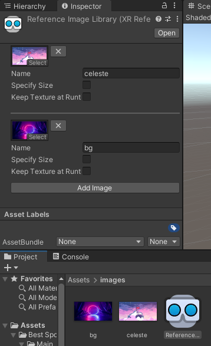
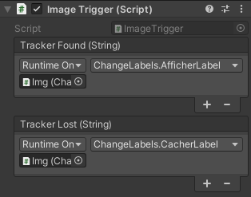

# Détection d'image

Il est possible de détecter lorsqu'une ou plusieurs images sont présentes dans le champs de vision de la caméra.

Pour se simplifier la vie, le script [ImageTrigger.cs](scripts/ImageTrigger.cs) lance un événement lorsqu'une image est détectée ou perdue.

1. Ajouter les images à détectée dans les assets du projet. Les images doivent avoir des noms en minuscules sans symboles
2. Créer un asset `Create > XR > Reference Image Library`. (Attention, pas Object Library!)

    

3. Ajouter les images au `Reference Image Library`. Le `Name` de chaque image devrait correspondre au nom du fichier d'image pour éviter des problèmes plus tard.

    

4. Ajouter un `AR Tracked Image Manager` à notre objet `AR Session Origin`.
    * Associer l'asset `Reference Image Library` au component `AR Tracked Image Manager`
    * Changer le `Max Number of Moving Object` au nombre d'objets maximum qui peuvent être visible en même temps.

5. Ajouter le script [ImageTrigger.cs](scripts/ImageTrigger.cs) à notre `AR Session Origin`.
6. Appeler les fonctions **publiques** de notre choix présentes dans un script. Les fonctions recoivent un paramètre de type `string` qui représente le nom du tracker qui est détecté ou perdu. Par exemple:
    ```c#
    public void AfficherLabel(string name)
    {
        Debug.Log("Tracker trouvé: " + name);
    }
    public void CacherLabel(string name)
    {
        Debug.Log("Tracker perdu: " + name);
    }
    ```

    