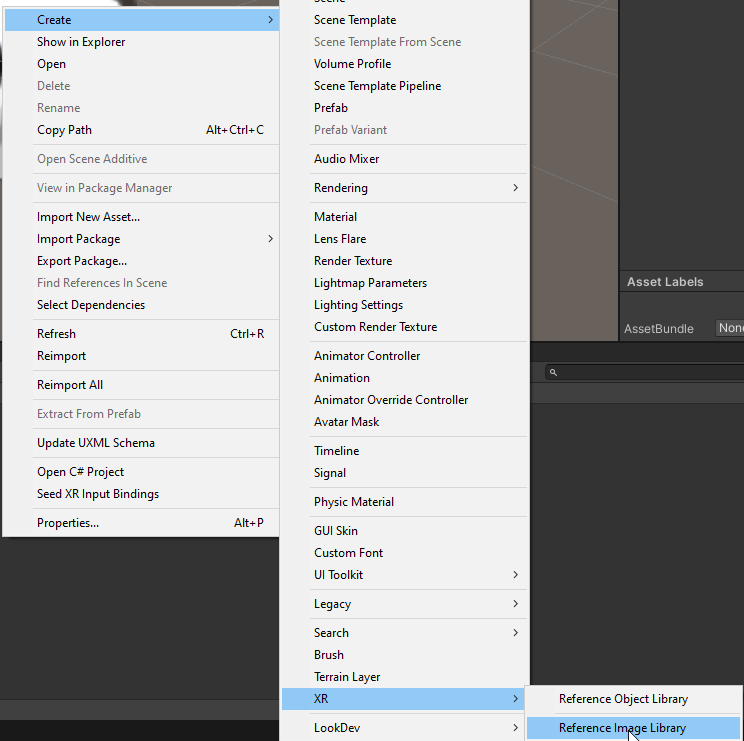

# Tracking d'images multiples

1. Ajouter les images à détectée dans les assets du projet. Les images doivent avoir des noms en minuscules sans symboles
2. Créer un asset `Create > XR > Reference Image Library`. (Attention, pas Object Library!)

    

3. Ajouter les images au `Reference Image Library`. Le `Name` de chaque image devrait correspondre au nom du fichier d'image pour éviter des problèmes plus tard.

    

4. Ajouter un `AR Tracked Image Manager` à notre objet `AR Session Origin`.
    * Associer l'asset `Reference Image Library` au component `AR Tracked Image Manager`
    * Changer le `Max Number of Moving Object` au nombre d'objets maximum qui peuvent être visible en même temps.

5. Ajouter le script [MultipleTracking.cs](scripts/MultipleTracking.cs) à notre `AR Session Origin`.
    * Ajouter les prefabs portant **exactement** le même nom que les tracker au component  `Multiple Tracking` (Attention au scale du prefab qui devrait tourner autour de 0.05)
    * Choisir si la rotation doit suivre le tracker ou pas

    